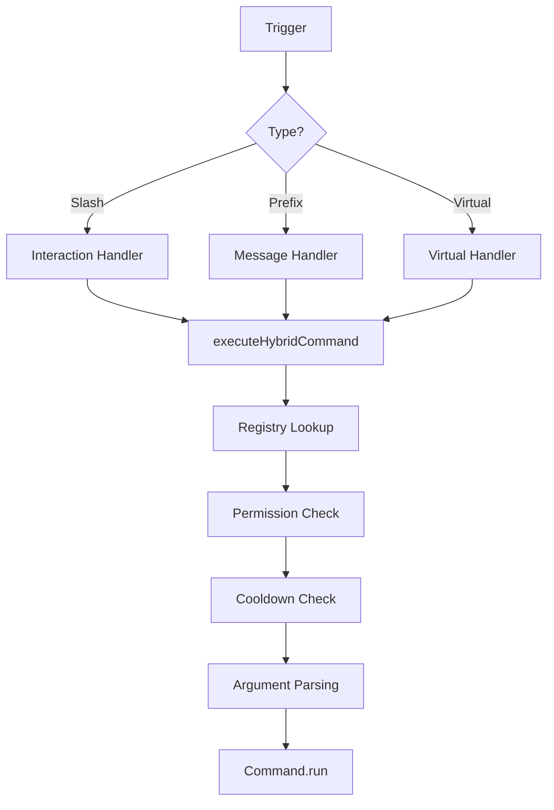

# Framework Internals & Documentation

This document provides a deep dive into the architecture of the Hybrid Command Framework. It explains how every component works, from command registration to execution.

## 📚 Table of Contents
1. [Architecture Overview](#architecture-overview)
2. [Command Structure](#command-structure)
3. [The Registry System](#the-registry-system)
4. [Execution Engine](#execution-engine)
5. [Argument Parsing (Lexer)](#argument-parsing-lexer)
6. [Configuration Manager](#configuration-manager)
7. [Validation & Error Handling](#validation--error-handling)

---

## Architecture Overview

The framework is built on a **Unified Execution Model**. Whether a command is triggered via a Slash Command (Interaction), a Prefix Message, or Programmatically, it flows through the exact same pipeline:



---

## Command Structure

Every command is a `HybridCommand` object defined in TypeScript.

### Interface
```typescript
export interface HybridCommand {
  name: string;              // Canonical ID (1-32 chars, lowercase)
  description: string;       // Required for Slash Commands (1-100 chars)
  type?: 'slash' | 'prefix' | 'both'; // Default: 'both'
  aliases?: string[];        // Alternative names (Prefix only)
  args?: string;             // Grammar string (e.g., "<user:user> <reason...>")
  level?: 'User' | 'Admin' | 'ServerOwner' | 'Developer';
  permissions?: PermissionResolvable[]; // Discord permissions (e.g., 'BanMembers')
  cooldown?: number;         // In seconds
  
  run(ctx: HybridContext): Promise<void>;
  auto?(ctx: HybridContext): Promise<void>; // Optional autocomplete handler
}
```

---

## The Registry System
**File:** `src/plugins/converter/registry.ts`

The Registry is the single source of truth for all commands. It handles:

1.  **Canonical IDs**: Maps every command to a unique name.
2.  **Alias Resolution**: Maps aliases (e.g., `p`) to the canonical name (`ping`).
3.  **Collision Detection**:
    - **Fatal Error**: If two commands have the same name.
    - **Fatal Error**: If an alias conflicts with an existing command or alias.
4.  **Fingerprinting**:
    - Calculates an MD5 hash of the command file content (normalized for line endings).
    - Used by `ConfigManager` to detect file renames and moves.

---

## Execution Engine
**File:** `src/plugins/converter/execution.ts`

The heart of the framework. `executeHybridCommand` handles the entire lifecycle:

1.  **Trigger Normalization**: Converts `Message`, `Interaction`, or `VirtualTrigger` into a standard format.
2.  **Command Resolution**: Finds the command via Registry (checking aliases if needed).
3.  **Autocomplete Routing**: If the trigger is an autocomplete interaction, it calls `cmd.auto()`.
4.  **Permission System**:
    - Checks `level` (Developer > ServerOwner > Admin > User).
    - Checks native Discord `permissions` (e.g., `ManageMessages`).
5.  **Cooldowns**:
    - Uses `performance.now()` for a monotonic clock (immune to system time changes).
    - Tracks cooldowns by `CommandName + UserId`.
6.  **Auto-Deferral**:
    - For Slash Commands, if execution takes >250ms, it automatically calls `deferReply()` to prevent "Interaction failed".
    - Safe against race conditions (checks `replied` and `deferred` flags).
7.  **Error Handling**:
    - Catches all errors during execution.
    - Replies with a safe error message to the user.
    - Logs the full error stack to the console.

---

## Argument Parsing (Lexer)
**File:** `src/plugins/converter/lexer.ts` & `grammar.ts`

### Prefix Commands
We use a custom **Lexer** to parse arguments from raw message strings.
- **Features**:
    - Handles quoted strings: `!echo "Hello World"` -> `Hello World`
    - Handles escaped quotes: `!echo "He said \"Hi\""` -> `He said "Hi"`
    - Handles Unicode: `!echo 🚀` -> `🚀`
- **Grammar**:
    - Parses the `args` string defined in the command.
    - Maps tokens to types: `string`, `number`, `boolean`, `user`, `channel`, `role`.

### Slash Commands
Arguments are natively parsed by Discord. The framework maps them to the same `args` object in `HybridContext`, ensuring your code looks the same regardless of source.

---

## Configuration Manager
**File:** `src/utils/config.ts`

The `ConfigManager` ensures your `commands.json` is always in sync with your code.

- **Sync Logic**:
    - On startup, it scans all command files.
    - It compares the file's **Fingerprint** with the one in `commands.json`.
    - **Rename Detection**: If a file is renamed but has the same fingerprint, it updates the config entry instead of creating a duplicate.
    - **Move Detection**: If a file is moved to a different category, it moves the config entry.
- **Runtime Overrides**:
    - You can disable commands or change cooldowns in `commands.json`.
    - These settings override the code defaults at runtime.

---

## Validation & Error Handling
**File:** `src/plugins/converter/register.ts`

### Strict Validation
The framework enforces strict rules at startup to prevent runtime crashes:
- **Missing Metadata**: Fatal error if `name`, `description`, or `run` is missing.
- **Invalid Name**: Fatal error if name contains invalid characters.
- **Builder Errors**: Fatal error if Slash Command construction fails.

### Clean Exits
Validation errors trigger a `process.exit(1)` with a clear error message, avoiding noisy stack traces and making debugging easier.
