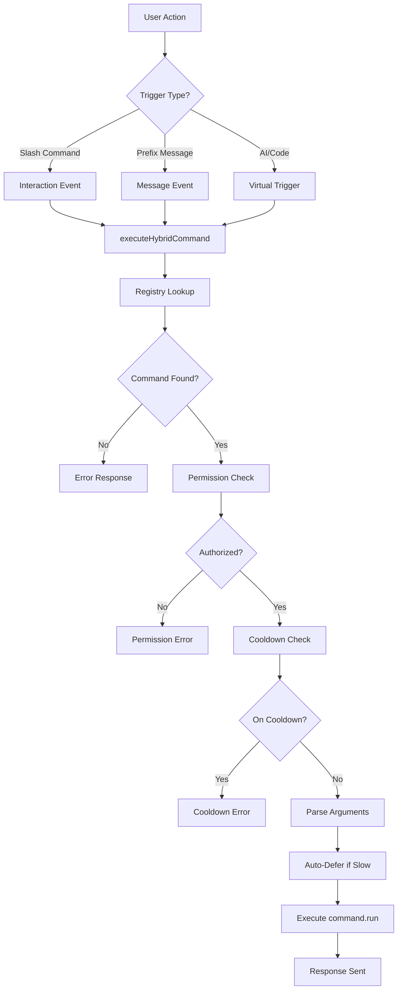

# Hybrid Discord Bot

A powerful Discord bot template featuring a **Hybrid Command System** (Slash + Prefix), **Dynamic Configuration**, and **Hierarchical Permissions**.


> [!TIP]
> **New to the framework?**
> Check out [FRAMEWORK_DOCS.md](FRAMEWORK_DOCS.md) for a deep dive into how everything works under the hood!

## 📋 Requirements

- **Node.js**: v16.9.0 or higher (v18+ recommended)
- **npm**: v7.0.0 or higher
- **Discord Bot Token**: [Create one here](https://discord.com/developers/applications)
- **TypeScript**: Included as dev dependency

## 📦 Installation

1.  **Install dependencies**:
    ```bash
    npm install
    ```

2.  **Setup Environment**:
    Rename `.env.example` to `.env` and fill in your details:
    ```env
    DISCORD_TOKEN=your_bot_token
    PREFIX=!
    OWNER_IDS=123456789,987654321
    MONGODB_URI=mongodb://localhost:27017/avinex
    ```

3.  **Setup Database**:
    Ensure you have MongoDB installed and running locally, or use a cloud provider like MongoDB Atlas.

4.  **Run Development Mode**:
    ```bash
    npm run dev
    ```

## 🌟 Key Features

- **Hybrid Commands**: Write once, run as Slash (`/`) or Prefix (`!`).
- **Unified Execution**: Same logic for all trigger types.
- **Robust Validation**: Fatal errors for invalid commands at startup.
- **Smart Config**: `commands.json` auto-syncs even if you rename or move files.
- **Monotonic Cooldowns**: Accurate cooldowns immune to system time changes.
- **Auto-Deferral**: Never see "Interaction failed" again for slow commands.

## 🛠 Creating Commands

**The easiest way to create a command is using the CLI generator:**

```bash
npm run cc
```

This interactive tool will ask for the category, name, type, and permission level, then generate a clean file for you.

### Manual Creation
Create a new file in `src/commands/`.

```typescript
import { HybridCommand } from '../plugins/converter/types';

const command: HybridCommand = {
  name: 'greet',
  description: 'Greets a user',
  type: 'both',
  level: 'User',
  args: '<name:string> <age:number?>', 
  
  async run(ctx) {
    const { name, age } = ctx.args;
    await ctx.reply(`Hello ${name}!`);
  }
};

export default command;
```

For more details on argument grammar and advanced usage, see [FRAMEWORK_DOCS.md](info&instructions/FRAMEWORK_DOCS.md).

## 🎨 Container Component Helper

Build modern Discord V2 message components with ease using the `Container` helper:

```typescript
import { Container } from './lib/components';
import { MessageFlags } from 'discord.js';

const container = new Container()
    .setColor('#5865F2')
    .addHeader('## Dashboard', { divider: true })
    .addText('Welcome to the bot!')
    .addSection({
        texts: ['**Status:** Online', '**Users:** 1,234'],
        accessory: {
            type: 'button',
            label: 'Refresh',
            customId: 'refresh',
            style: 'primary'
        }
    })
    .addDivider()
    .addFooter('*Last updated: now*');

await ctx.reply({
    components: [container],
    flags: [MessageFlags.IsComponentsV2]
});
```

**Features:**
- Text, Separators, Sections (with thumbnails/buttons)
- Media Galleries, Attachments
- Action Rows (buttons & select menus)
- Custom helpers: `addHeader()`, `addFooter()`, `addDivider()`
- Automatic validation (40 component limit, 3 texts per section)

See [componentGuide.md](info&instructions/componentGuide.md) for complete documentation.

## 🔀 Router Plugin (Component Handlers)

Handle Discord buttons and select menus directly in your commands with automatic state management:

```typescript
const command: HybridCommand = {
    name: 'poll',
    description: 'Create a poll',
    run: async (ctx) => {
        // Create button with state (auto-expires in 300 seconds)
        const voteId = ctx.createId('vote', { option: 'A' }, 300);
        
        const container = new Container()
            .addText('Vote for option A!')
            .addActionRow({
                buttons: [{
                    customId: voteId,
                    label: 'Vote',
                    style: 'primary'
                }]
            });

        await ctx.reply({
            components: [container],
            flags: [MessageFlags.IsComponentsV2]
        });
    },

    // Handler is co-located with command!
    components: {
        vote: async (ctx: ComponentContext) => {
            const { option } = ctx.state; // Auto-hydrated!
            await ctx.interaction.reply(`You voted for ${option}!`);
        }
    }
};
```

**Features:**
- **Co-located Handlers**: Define button/menu logic right with your command
- **Hybrid State**: L1 (Memory) + L2 (Redis) for speed & persistence
- **Auto-Cleanup**: State expires automatically (Garbage Collected)
- **Safety**: Memory overflow protection & circular reference checks
- **Global Handlers**: Share common handlers across all commands
- **Permissions**: Granular access control (roles, users, permissions, cooldowns)

**📖 Full Guide:** See [ROUTER_PLUGIN_GUIDE.md](info&instructions/ROUTER_PLUGIN_GUIDE.md) for comprehensive examples including:
- Confirmation dialogs
- Stateful counters
- Paginated lists
- Select menus
- Permission controls
- And much more!

## 🤖 Programmatic Command Execution

You can execute commands programmatically from anywhere in your code. This is perfect for **AI agents** or **internal automation**.

```typescript
import { executeCommand } from './plugins/converter/register';

// Example: AI decides to ban a user
await executeCommand(
  client,
  user,
  channel,
  'ban',
  { user: targetUser, reason: 'AI detected spam' }
);

// Example: Execute a subcommand
await executeCommand(
  client,
  user,
  channel,
  'user info',
  { target: someUser }
);
```

**Parameters:**
- `client`: The Discord.js Client instance
- `user`: The User executing the command
- `channel`: The TextBasedChannel to send responses to
- `commandName`: Command name (or "group subcommand" for subcommands)
- `args`: Object with command arguments

## 📜 Utility Scripts

| Script | Alias | Description |
| :--- | :--- | :--- |
| `npm run dev` | - | Start bot with hot-reload |
| `npm run build` | - | Compile TypeScript |
| `npm run create-command` | `npm run cc` | **Interactive Command Generator** |
| `npm run verify` | - | Verify framework integrity |
| `npm run reset-commands` | `npm run rs` | Clear all slash commands from Discord |
| `npm run sync-config` | `npm run sc` | Sync `commands.json` with codebase |
| `npm run refresh` | `npm run rf` | Reset + Sync (full refresh) |

## 📁 Code Base Structure

```text
hybrid-bot/
├── src/
│   ├── commands/       # Your command files
│   ├── plugins/        # Core framework logic
│   ├── scripts/        # Utility scripts
│   ├── utils/          # Helpers (Config, Logger)
│   ├── client.ts       # Client setup
│   └── index.ts        # Entry point
├── commands.json       # Dynamic config (Auto-generated)
└── README.md           # This file
```

## 🏗 Architecture Overview

The framework uses a **Unified Execution Pipeline** that processes commands identically regardless of their trigger source:



**Key Components:**
- **Registry**: Single source of truth for all commands
- **Execution Engine**: Handles permissions, cooldowns, and auto-deferral
- **Lexer/Grammar**: Parses prefix command arguments
- **Config Manager**: Smart configuration with fingerprint tracking

## ⚡ Advanced Features

### Permission Hierarchy
Four permission levels enforce access control:
- **User** - Everyone can use
- **Admin** - Requires `Administrator` permission
- **ServerOwner** - Only the server owner
- **Developer** - Bot owners only (configured via `OWNER_IDS`)

### Monotonic Cooldown System
Uses `performance.now()` instead of `Date.now()` to prevent cooldown bypasses when system time is changed.

### Auto-Deferral Mechanism
Automatically defers Discord interactions if command execution exceeds 250ms, preventing "Interaction failed" errors.

### Fingerprint-Based Config Tracking
Each command file has an MD5 fingerprint. When you rename or move a command file, the config system automatically updates instead of creating duplicate entries.

### Collision Detection
Fatal errors during startup if:
- Two commands have the same name
- An alias conflicts with another command or alias

## 🔧 Troubleshooting

### Command not appearing as slash command
Run the refresh script to sync with Discord:
```bash
npm run rf
```

### "Interaction failed" errors
The framework auto-defers after 250ms, but if you see this:
- Check if your command logic has errors
- Ensure you're using `await` on async operations
- Look for errors in the console logs

### Commands loading but not executing
Check the permissions in your command file:
```typescript
level: 'Admin',  // Make sure user has admin permissions
permissions: ['ManageMessages']  // Ensure required Discord permissions
```

### TypeScript compilation errors after update
Clear the build directory and rebuild:
```bash
rm -rf dist
npm run build
```

### Package installation issues
Delete `node_modules` and `package-lock.json`, then reinstall:
```bash
rm -rf node_modules package-lock.json
npm install
```

## 📚 Additional Resources

- **[FRAMEWORK_DOCS.md](FRAMEWORK_DOCS.md)** - Deep dive into internals
- **[ROUTER_PLUGIN_GUIDE.md](info&instructions/ROUTER_PLUGIN_GUIDE.md)** - Complete guide to component handlers
- **[SYSTEM_DOCS.md](SYSTEM_DOCS.md)** - Main Bot System Architecture & Modules
- **[Discord.js Guide](https://discordjs.guide/)** - Learn Discord.js basics
- **[Sapphire Framework Docs](https://www.sapphirejs.dev/)** - Official Sapphire documentation

## 📝 License

This project is provided as-is for educational and development purposes.

---

**Built with ❤️ using Sapphire Framework and Discord.js**
