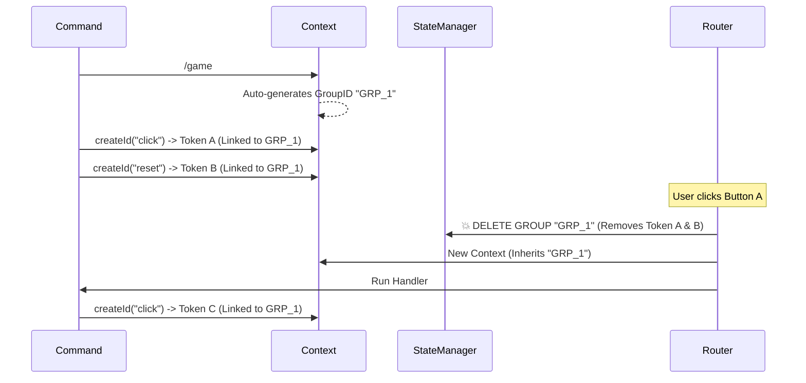

# Router Plugin - Complete Guide

## Table of Contents
- [Overview](#overview)
- [Quick Start](#quick-start)
- [Core Concepts](#core-concepts)
- [Step-by-Step Examples](#step-by-step-examples)
- [Advanced Features](#advanced-features)
- [API Reference](#api-reference)
- [Best Practices](#best-practices)

---

## Overview

The Router Plugin is a powerful system for handling Discord component interactions (buttons, select menus) with:
- **Co-located Handlers**: Define handlers right next to your command logic
- **State Management**: Pass data between interactions with automatic expiration
- **Lazy Registration**: Fast startup, minimal memory usage
- **Global Handlers**: Share handlers across all commands
- **Granular Permissions**: Control who can click what

### How It Works

```
1. Command creates button → Generates ID: "poll:vote:a1b2c3"
                              ↓            ↓     ↓
                           Command  Handler  State Token
                              ↓            ↓
2. User clicks button → Router finds "poll" command, executes "vote" handler
                              ↓
3. State is auto-loaded into ctx.state → Your handler has the data
```

---

## Quick Start

### 1. Basic Button (No State)

```typescript
import { HybridCommand, ComponentContext } from '../../plugins/converter/types';
import { Container } from '../../lib/components';
import { MessageFlags } from 'discord.js';

const command: HybridCommand = {
    name: 'hello',
    description: 'Say hello',
    run: async (ctx) => {
        const container = new Container()
            .addText('Click the button!')
            .addActionRow({
                buttons: [{
                    customId: ctx.createId('greet'), // Generates "hello:greet:random"
                    label: 'Say Hello',
                    style: 'primary'
                }]
            });

        await ctx.reply({
            components: [container],
            flags: [MessageFlags.IsComponentsV2]
        });
    },

    components: {
        greet: async (ctx: ComponentContext) => {
            await ctx.interaction.reply({
                content: 'Hello! 👋',
                ephemeral: true
            });
        }
    }
};

export default command;
```

**Key Points:**
- Use `ctx.createId(key)` to generate button IDs
- Pass `[container]`
- **Always** include `flags: [MessageFlags.IsComponentsV2]` when using containers
- Define handlers in `components: { ... }`

---

## Core Concepts

### 1. ID Generation

```typescript
// Simple ID (no state)
ctx.createId('vote')
// → "poll:vote:abc123"

// With state (30 second TTL)
ctx.createId('vote', { userId: '123', option: 'A' }, 30)
// → "poll:vote:def456"
// State is stored in memory: def456 -> { userId: '123', option: 'A' }
```

**ID Structure:**
```
commandName : handlerKey : stateToken
    ↓            ↓             ↓
  "poll"      "vote"      "abc123"
```

### 2. State Lifecycle

```typescript
// 1. CREATE STATE
const btnId = ctx.createId('confirm', { targetId: '123' }, 60);
// State lives for 60 seconds in RAM

// 2. BUTTON CLICK
components: {
    confirm: async (ctx: ComponentContext) => {
        if (!ctx.state) {
            // State expired or never existed
            return ctx.interaction.reply('Expired!');
        }
        
        // Use the state
        const { targetId } = ctx.state;
    }
}
```

**State Storage:**
- 💾 **Hybrid Architecture**:
  - **L1 (Memory)**: Ultra-fast access for immediate interactions.
  - **L2 (Redis)**: Persistent storage for scalability and reliability (Optional).
- ⏱️ **TTL**: Default 60s, customizable.
- 🔄 **Cleanup**: Auto-cleaned every 60s.
- 🛡️ **Safety**: Memory overflow protection and circular reference checks.

### 3. Hybrid Redis System (New!)

The Router now supports a robust Hybrid L1/L2 caching system.

**Features:**
- **Performance**: Reads from Memory (L1) first.
- **Persistence**: Writes to Redis (L2) for cross-instance support.
- **Safety**:
  - **Overflow Guard**: Auto-clears old memory if limit (10k) is reached.
  - **Race Condition Handling**: L1 acts as a lock, Redis as the truth.
  - **JSON Safety**: Prevents crashes from circular objects.
  - **Smart Retries**: Exponential backoff if Redis goes down.

**Configuration:**
```env
ENABLE_REDIS=true
REDIS_URI=redis://localhost:6379
```

**Dependency Injection:**
You can also bring your own Redis client:
```typescript
registerRouterPlugin(client, { redisClient: myRedisInstance });
```

### 3. Automatic State Cleanup & Grouping

The Router now automatically manages "Message Groups" to prevent memory leaks.

**How it works:**
1. **Auto-Grouping**: When you run a command, `ctx` generates a unique `groupId`.
2. **Linking**: All buttons created with `ctx.createId()` are linked to this group.
3. **Instant Cleanup**: When *any* button in the group is clicked, **ALL** tokens for that group are deleted.
4. **Continuity**: The `groupId` is passed to the next interaction, keeping the session alive.

**Visual Flow:**


### 4. Component Context

```typescript
components: {
    myHandler: async (ctx: ComponentContext) => {
        ctx.interaction  // ButtonInteraction | SelectMenuInteraction
        ctx.state        // Your data (or null if expired)
        ctx.user         // User who clicked
        ctx.guild        // Guild where clicked
        ctx.createId()   // Generate new IDs (Auto-grouped)
        ctx.groupId      // Current Group ID
    }
}
```

---

## Step-by-Step Examples

### Example 1: Confirmation Dialog

```typescript
const command: HybridCommand = {
    name: 'ban',
    description: 'Ban a user',
    args: '<user:user> [reason...]?',
    run: async (ctx) => {
        const target = ctx.args.user;
        const reason = ctx.args.reason || 'No reason';

        // Store ban details with 2-minute expiration
        const confirmId = ctx.createId('confirm', {
            targetId: target.id,
            targetTag: target.tag,
            reason: reason
        }, 120);

        const cancelId = 'global_cancel'; // Global handler

        const container = new Container()
            .addText(`⚠️ **Confirm Ban**\n\n**User:** ${target.tag}\n**Reason:** ${reason}`)
            .addActionRow({
                buttons: [
                    { customId: confirmId, label: 'Confirm', style: 'danger' },
                    { customId: cancelId, label: 'Cancel', style: 'secondary' }
                ]
            });

        await ctx.reply({
            components: [container],
            flags: [MessageFlags.IsComponentsV2],
            ephemeral: true
        });
    },

    components: {
        confirm: async (ctx: ComponentContext) => {
            if (!ctx.state) {
                return ctx.interaction.reply({
                    content: '❌ Confirmation expired (2 minutes)',
                    ephemeral: true
                });
            }

            const { targetId, targetTag, reason } = ctx.state;

            try {
                await ctx.guild!.members.ban(targetId, { reason });
                await ctx.interaction.update({
                    content: `✅ Banned **${targetTag}**`,
                    components: []
                });
            } catch (error) {
                await ctx.interaction.reply({
                    content: '❌ Failed to ban user.',
                    ephemeral: true
                });
            }
        }
    }
};
```

### Example 2: Counter (Stateful Updates)

```typescript
const command: HybridCommand = {
    name: 'counter',
    description: 'Interactive counter',
    run: async (ctx) => {
        const container = new Container()
            .addText('**Counter: 0**')
            .addActionRow({
                buttons: [
                    {
                        customId: ctx.createId('increment', { count: 0 }, 300),
                        label: '➕ Increment',
                        style: 'success'
                    },
                    {
                        customId: 'global_cancel',
                        label: '❌ Close',
                        style: 'danger'
                    }
                ]
            });

        await ctx.reply({
            components: [container],
            flags: [MessageFlags.IsComponentsV2]
        });
    },

    components: {
        increment: async (ctx: ComponentContext) => {
            if (!ctx.state) {
                return ctx.interaction.reply({
                    content: '⏱️ Counter expired (5 minutes)',
                    ephemeral: true
                });
            }

            const newCount = ctx.state.count + 1;

            // Generate new button with updated state
            const container = new Container()
                .addText(`**Counter: ${newCount}**`)
                .addActionRow({
                    buttons: [{
                        customId: ctx.createId('increment', { count: newCount }, 300),
                        label: '➕ Increment',
                        style: 'success'
                    }]
                });

            await ctx.interaction.update({
                components: [container],
                flags: [MessageFlags.IsComponentsV2]
            });
        }
    }
};
```

### Example 3: Select Menu with State

```typescript
const command: HybridCommand = {
    name: 'role',
    description: 'Choose a role',
    run: async (ctx) => {
        const availableRoles = [
            { id: '123', name: 'Developer' },
            { id: '456', name: 'Designer' },
            { id: '789', name: 'Manager' }
        ];

        // Store role data
        const menuId = ctx.createId('select', {
            roles: availableRoles,
            userId: ctx.user.id
        }, 180);

        const container = new Container()
            .addText('**Choose Your Role**')
            .addActionRow({
                menu: {
                    type: 'string',
                    customId: menuId,
                    placeholder: 'Select a role...',
                    options: availableRoles.map(r => ({
                        label: r.name,
                        value: r.id
                    }))
                }
            });

        await ctx.reply({
            components: [container],
            flags: [MessageFlags.IsComponentsV2],
            ephemeral: true
        });
    },

    components: {
        select: async (ctx: ComponentContext) => {
            if (!ctx.state) {
                return ctx.interaction.reply({
                    content: '⏱️ Selection expired',
                    ephemeral: true
                });
            }

            // Type assertion for select menu
            const interaction = ctx.interaction as StringSelectMenuInteraction;
            const selectedRoleId = interaction.values[0];

            const role = ctx.state.roles.find((r: any) => r.id === selectedRoleId);

            try {
                await (ctx.member as GuildMember).roles.add(selectedRoleId);
                await ctx.interaction.reply({
                    content: `✅ Assigned role: **${role.name}**`,
                    ephemeral: true
                });
            } catch (error) {
                await ctx.interaction.reply({
                    content: '❌ Failed to assign role',
                    ephemeral: true
                });
            }
        }
    }
};
```

### Example 4: Paginated List

```typescript
const command: HybridCommand = {
    name: 'list',
    description: 'Paginated list',
    run: async (ctx) => {
        const items = Array.from({ length: 50 }, (_, i) => `Item ${i + 1}`);
        const page = 0;
        const itemsPerPage = 5;

        showPage(ctx, items, page, itemsPerPage);
    },

    components: {
        next: async (ctx: ComponentContext) => {
            if (!ctx.state) return ctx.interaction.reply({ content: 'Expired', ephemeral: true });
            
            const { items, page, itemsPerPage } = ctx.state;
            const maxPage = Math.ceil(items.length / itemsPerPage) - 1;
            const newPage = Math.min(page + 1, maxPage);

            await updatePage(ctx, items, newPage, itemsPerPage);
        },

        prev: async (ctx: ComponentContext) => {
            if (!ctx.state) return ctx.interaction.reply({ content: 'Expired', ephemeral: true });
            
            const { items, page, itemsPerPage } = ctx.state;
            const newPage = Math.max(page - 1, 0);

            await updatePage(ctx, items, newPage, itemsPerPage);
        }
    }
};

function showPage(ctx: any, items: string[], page: number, itemsPerPage: number) {
    const start = page * itemsPerPage;
    const end = start + itemsPerPage;
    const pageItems = items.slice(start, end);
    const maxPage = Math.ceil(items.length / itemsPerPage) - 1;

    const container = new Container()
        .addText(`**Page ${page + 1}/${maxPage + 1}**\n\n${pageItems.join('\n')}`)
        .addActionRow({
            buttons: [
                {
                    customId: ctx.createId('prev', { items, page, itemsPerPage }, 180),
                    label: '◀️ Previous',
                    style: 'secondary',
                    disabled: page === 0
                },
                {
                    customId: ctx.createId('next', { items, page, itemsPerPage }, 180),
                    label: 'Next ▶️',
                    style: 'secondary',
                    disabled: page === maxPage
                }
            ]
        });

    ctx.reply({ components: [container], flags: [MessageFlags.IsComponentsV2] });
}

async function updatePage(ctx: ComponentContext, items: string[], page: number, itemsPerPage: number) {
    const start = page * itemsPerPage;
    const end = start + itemsPerPage;
    const pageItems = items.slice(start, end);
    const maxPage = Math.ceil(items.length / itemsPerPage) - 1;

    const container = new Container()
        .addText(`**Page ${page + 1}/${maxPage + 1}**\n\n${pageItems.join('\n')}`)
        .addActionRow({
            buttons: [
                {
                    customId: ctx.createId('prev', { items, page, itemsPerPage }, 180),
                    label: '◀️ Previous',
                    style: 'secondary',
                    disabled: page === 0
                },
                {
                    customId: ctx.createId('next', { items, page, itemsPerPage }, 180),
                    label: 'Next ▶️',
                    style: 'secondary',
                    disabled: page === maxPage
                }
            ]
        });

    await ctx.interaction.update({
        components: [container],
        flags: [MessageFlags.IsComponentsV2]
    });
}
```

---

## Advanced Features

### Granular Permissions

```typescript
components: {
    adminOnly: {
        ownerOnly: true, // Only bot owner
        run: async (ctx) => {
            await ctx.interaction.reply('Admin action!');
        }
    },

    modOnly: {
        permissions: [PermissionFlagsBits.BanMembers],
        run: async (ctx) => {
            await ctx.interaction.reply('Mod action!');
        }
    },

    roleRestricted: {
        roles: ['123456789'], // Specific role IDs
        run: async (ctx) => {
            await ctx.interaction.reply('Role-specific action!');
        }
    },

    userList: {
        users: ['987654321'], // Specific user IDs
        run: async (ctx) => {
            await ctx.interaction.reply('User-specific action!');
        }
    },

    cooldown: {
        cooldown: 30, // 30 seconds
        run: async (ctx) => {
            await ctx.interaction.reply('Rate-limited action!');
        }
    }
}
```

### Global Handlers

**Define once, use everywhere:**

```typescript
// src/handlers/global.ts
import { ComponentRegistry } from '../plugins/router/registry';

export function registerGlobalHandlers() {
    ComponentRegistry.registerComponentHandler('global_cancel', async (ctx) => {
        await ctx.interaction.reply({
            content: '❌ Cancelled.',
            ephemeral: true
        });
    });

    ComponentRegistry.registerComponentHandler('global_close', async (ctx) => {
        if (ctx.interaction.message) {
            await ctx.interaction.message.delete();
        }
    });
}
```

**Use in any command:**

```typescript
const container = new Container()
    .addText('Do you want to continue?')
    .addActionRow({
        buttons: [
            { customId: 'global_cancel', label: 'Cancel', style: 'danger' }
        ]
    });//no need to use ctx.createId() write the command name directly (drawback cannot use state)
```

### Command Aliases (Stability)

```typescript
const command: HybridCommand = {
    name: 'poll_v2',
    aliases: ['poll'], // OLD NAME HERE
    description: 'Create a poll',
    run: async (ctx) => { ... },
    components: { vote: async (ctx) => { ... } }
};
```

**Why?**
- Old buttons (ID: `poll:vote`) still work
- New buttons (ID: `poll_v2:vote`) also work
- Zero downtime during refactoring

---

## API Reference

### `ctx.createId(key, data?, ttl?)`

Generate a component custom ID with optional state.

**Parameters:**
- `key` (string): Handler name (must match `components` key)
- `data` (any, optional): Serializable data to store
- `ttl` (number, optional): Time-to-live in seconds (default: 60)
- `messageGroupId` (string, optional): **Auto-handled**. Only pass if you need custom grouping.

**Returns:** `string` - Custom ID for Discord

**Throws:** Error if ID exceeds 100 characters

**Example:**
```typescript
ctx.createId('vote')                           // "poll:vote:abc"
ctx.createId('vote', { opt: 'A' })            // "poll:vote:def" + state
ctx.createId('vote', { opt: 'A' }, 300)       // 5-minute TTL
```

### `ComponentContext`

Extended context for component handlers.

**Properties:**
```typescript
interface ComponentContext extends HybridContext {
    interaction: ButtonInteraction | StringSelectMenuInteraction;
    state: any;              // Hydrated state or null
    componentArgs: string[]; // Extra ID parts (rarely used)
    groupId?: string;        // The current Message Group ID
}
```

### `ComponentConfig`

Advanced handler configuration.

```typescript
interface ComponentConfig {
    run: (ctx: ComponentContext) => Promise<void>;
    permissions?: PermissionResolvable[];
    roles?: string[];
    users?: string[];
    ownerOnly?: boolean;
    cooldown?: number;
}
```

---

## Best Practices

### ✅ DO

```typescript
// Use descriptive handler keys
components: {
    confirmBan: async (ctx) => { ... },
    denyBan: async (ctx) => { ... }
}

// Always check state expiration
if (!ctx.state) return ctx.interaction.reply('Expired!');

// Use ephemeral for confirmations
await ctx.interaction.reply({ content: 'Done!', ephemeral: true });

// Include MessageFlags.IsComponentsV2
await ctx.reply({
    components: [container],
    flags: [MessageFlags.IsComponentsV2]
});

// Set appropriate TTLs
ctx.createId('confirm', data, 120) // 2 minutes for confirmations
ctx.createId('menu', data, 600)    // 10 minutes for complex forms
```

### ❌ DON'T

```typescript
// Don't store non-serializable data
ctx.createId('handler', {
    user: ctx.user,     // ❌ Discord object
    date: new Date()    // ❌ Date object
});

// Do this instead:
ctx.createId('handler', {
    userId: ctx.user.id,
    timestamp: Date.now()
});

// Don't use very long TTLs
ctx.createId('temp', data, 86400) // ❌ 24 hours = memory leak

// Don't create handlers outside components
client.on('interactionCreate', ...) // ❌ Bypasses Router
```

---

## Debugging

### Enable Dev Mode

```env
# .env
DEV_MODE=true
```

**Console Output:**
```
[Router] Interaction: poll:vote:abc123 (Prefix: poll, Key: vote)
[Router] State Hydrated for abc123
```

### Common Issues

**Issue: "No handler found"**
```
Solution: Check handler key matches customId key
- customId: ctx.createId('vote')
- components: { vote: ... } ✅
```

**Issue: "State is null"**
```
Solution: State expired or wasn't created
- Check TTL is long enough
- Verify you passed data to createId()
- State is lost on bot restart
```

**Issue: "ID length exceeded"**
```
Solution: Use shorter command/key names
- Command: 'poll' ✅  vs 'create_poll_with_options' ❌
- Key: 'vote' ✅  vs 'submit_vote_option' ❌
```

---

## Performance

- **Startup**: ~1ms per command with components (Lazy Registration)
- **Memory**: ~300 bytes per active state
- **Lookup**: O(1) - Instant handler resolution
- **Cleanup**: Runs every 60s, removes all expired state

---

## Migration from Old System

**Before (componentHandlers/):**
```typescript
// src/componentHandlers/buttons/poll.ts
registerButtonHandler('poll_vote', async (interaction) => {
    // Manual state management
    const data = await redis.get(`poll:${interaction.message.id}`);
    await interaction.reply('Voted!');
});
```

**After (Router Plugin):**
```typescript
// src/commands/utility/poll.ts
const command: HybridCommand = {
    name: 'poll',
    run: async (ctx) => {
        const btnId = ctx.createId('vote', { pollId: '123' });
        // ...
    },
    components: {
        vote: async (ctx) => {
            const { pollId } = ctx.state;
            await ctx.interaction.reply('Voted!');
        }
    }
};
```

**Benefits:**
- ✅ Co-located logic
- ✅ Auto state management
- ✅ Type safety
- ✅ Less boilerplate

---

## FAQ

**Q: What happens to buttons when the bot restarts?**  
A: If **Redis is enabled**, state is preserved! If using Memory only, state is lost.

**Q: Can I use persistent storage (database)?**  
A: Yes! Enable Redis in `.env` and your state will survive restarts.

**Q: How many buttons can I create?**  
A: Unlimited. Only *active* state tokens consume memory, and they auto-expire.

**Q: Can subcommands use components?**  
A: Yes! Works exactly the same way.

**Q: Can I have multiple handlers in one file?**  
A: Yes, unlimited handlers per command.

**Q: Do I need to manually delete tokens?**
A: **No!** The automatic grouping system handles cleanup for you. When a user clicks a button, all related tokens from the previous message are deleted instantly.

**Q: What is `ctx.groupId`?**
A: It's a unique ID generated for each command run. It links all components together. You rarely need to touch it manually, but it's available if you need to link components across different messages.

---

## Summary

The Router Plugin provides a modern, developer-friendly way to handle Discord components:

1. **Define handlers co-located with commands**
2. **Pass state seamlessly with `ctx.createId()`**
3. **Let the Router handle registration and lookup**
4. **Enjoy automatic cleanup and fast performance**

For questions or issues, check the logs with `DEV_MODE=true`!
