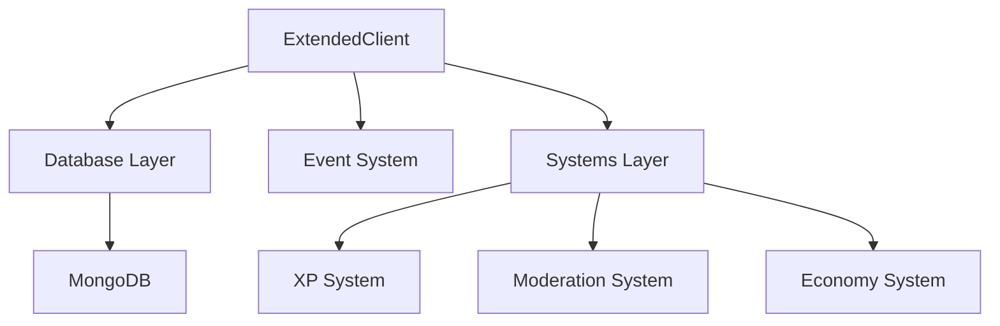

# Main Bot System Architecture

This document explains the architecture of the Main Bot System Layer built on top of the Hybrid Command Framework.

## 🏗 Architecture Overview

The bot is structured into distinct layers to ensure scalability and maintainability:



## 🧩 Core Components

### 1. ExtendedClient (`src/client/ExtendedClient.ts`)
The central hub of the bot. It extends `SapphireClient` and orchestrates:
- Database connection
- System loading
- Event loading
- Bot login

### 2. Database Layer (`src/database/`)
- **Manager**: Handles connection, retries, and graceful shutdown.
- **Models**: Mongoose schemas for `User`, `Guild`, etc.
- **Types**: Shared interfaces in `src/types/database.ts`.

### 3. Systems Layer (`src/systems/`)
Modular, independent features. Each system follows this pattern:
- **Manager**: Internal business logic and state.
- **Controller**: External API for commands to interact with.
- **Index**: Entry point extending `BaseSystem`.

**Example: XP System**
- `manager.ts`: Calculates level ups, adds XP to DB.
- `controller.ts`: Exposed methods like `addXP(user, amount)`.

### 4. Event System (`src/events/`)
Dynamic event loader. Events are defined as objects with `name`, `once`, and `execute`.

## 🚀 Adding a New System

1. Create a folder in `src/systems/<SystemName>/`.
2. Create `manager.ts` for logic.
3. Create `controller.ts` for external access.
4. Create `index.ts` extending `BaseSystem`.
5. The `ExtendedClient` will automatically load it!

## 📝 Database Models

- **Guild**: Server settings (prefix, modules enabled).
- **User**: Global user data (XP, level, balance).

## 🔒 Error Handling

Use `src/utils/errorHandler.ts` for centralized error logging.

```typescript
import { ErrorHandler } from '../utils/errorHandler';

try {
    // ...
} catch (error) {
    ErrorHandler.handle(error, 'ContextName');
}
```
