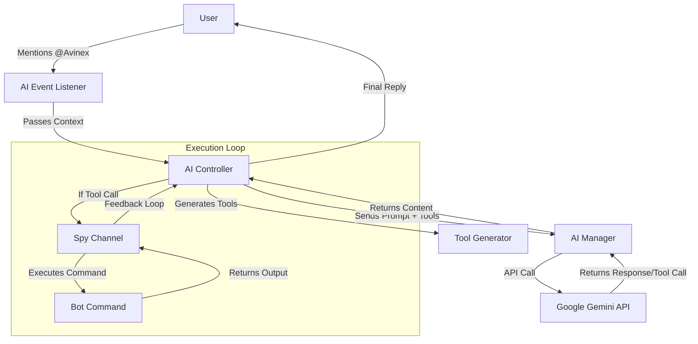

# Avinex AI System (Nex) Documentation

## 🤖 Overview
**Nex** is the intelligent AI assistant integrated into the Avinex Discord Bot. It leverages Google's **Gemini 2.5 Flash** model to provide natural language interactions, answer questions, and execute bot commands on behalf of the user.

## 🏗️ Architecture

The system is built on a modular architecture designed for safety, scalability, and seamless integration with the existing bot framework.

## 🧩 Core Components

### 1. AI Manager (`src/systems/AI/manager.ts`)
- **Role**: The "Brain". Handles direct communication with the Google Gemini API.
- **Key Responsibilities**:
    - Initializes the Gemini model.
    - Manages the **System Prompt** (Persona, Rules, Safety).
    - Sends prompts and tool definitions to the API.
    - Returns the raw AI response (text or function call).
- **Configuration**: Uses `GEMINI_API_KEY` from `.env`.

### 2. AI Controller (`src/systems/AI/controller.ts`)
- **Role**: The "Orchestrator". Manages the conversation flow and tool execution.
- **Key Responsibilities**:
    - **Tool Caching**: Generates tools once and reuses them for performance.
    - **Execution Loop**: Handles multi-step reasoning (AI calls tool -> Bot runs tool -> AI sees result -> AI replies).
    - **Spy Channel**: Creates a virtual channel proxy to intercept command outputs (so the AI can "see" what the bot sent).

### 3. Tool Generator (`src/systems/AI/tools.ts`)
- **Role**: The "Translator". Converts Discord commands into AI-understandable tools.
- **Key Responsibilities**:
    - Scans the bot's command registry.
    - Filters for **User-level** commands (Safety).
    - Converts command metadata (name, description, args) into JSON Schema for Gemini.
    - Handles argument parsing (e.g., converting "user" type to "User ID/Mention").
    - **Special Tools**: Injects manual tools like `send_container` for extended capabilities.

### 4. AI Event Listener (`src/events/aiChat.ts`)
- **Role**: The "Ear". Listens for user interactions.
- **Key Responsibilities**:
    - Detects messages mentioning `@Avinex`.
    - Filters out bots and role mentions.
    - Cleans the prompt (removes the bot's mention).
    - Triggers the `AIController`.

## 🛠️ Special Tools

### `send_container`
- **Purpose**: Allows Nex to send rich, structured messages (Cards) with images, headers, and footers.
- **Usage**:
    - **Header**: Title of the card.
    - **Text**: Main content.
    - **Image URL**: URL of an image to display.
    - **Footer**: Footer text.
- **Why?**: Discord's standard markdown doesn't support embedding images directly from URLs in a way that looks like a native embed. This tool bridges that gap.

## 🔒 Safety & Security

Nex is designed with strict safety boundaries:
1.  **Command Whitelist**: Only `User` level commands are converted into tools. Admin/Mod commands are strictly excluded.
2.  **System Prompt Rules**:
    - Explicitly forbidden from running `help` (explains instead).
    - Explicitly forbidden from executing code (writes markdown instead).
    - Identity enforcement (knows it's a "part of the bot").
3.  **Virtual Execution**: Commands run in a controlled context where the AI acts as the user, ensuring permissions are respected.

## 🔄 Data Flow Example

1.  **User says**: `@Avinex show avatar of @User`
2.  **Event Listener**: Detects mention, extracts prompt: `show avatar of @User`.
3.  **Controller**:
    - Fetches tools (including `user_avatar`).
    - Calls **Manager** with prompt.
4.  **Manager (Gemini)**: Decides to call tool `user_avatar` with arg `target: "@User"`.
5.  **Controller**:
    - Intercepts tool call.
    - Creates a `SpyChannel`.
    - Executes `!user avatar @User` virtually.
    - Captures bot response (Image URL).
6.  **Controller**: Sends image URL back to **Manager**.
7.  **Manager (Gemini)**: Generates final text: "Here is the avatar for @User!".
8.  **Controller**: Sends final reply to Discord.

## 🛠️ Adding New Capabilities

To add new skills to Nex, simply create a new **User-level Command** in the bot.
- The **Tool Generator** will automatically pick it up on the next restart.
- Ensure the command has a clear `description` and `args` definition.
